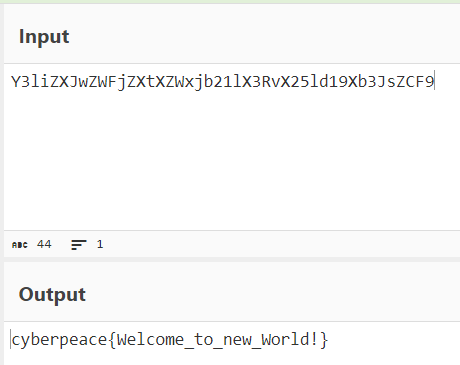
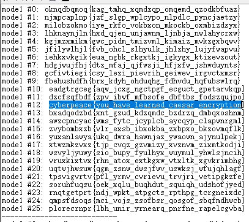
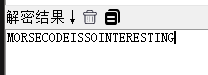
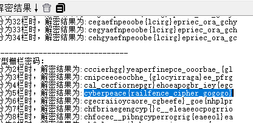
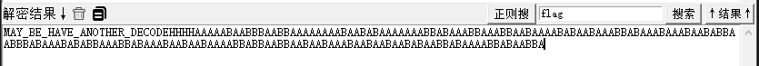
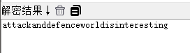

# base64

```csharp
Y3liZXJwZWFjZXtXZWxjb21lX3RvX25ld19Xb3JsZCF9
```

题目提示了base64



# Caesar

```csharp
oknqdbqmoq{kag_tmhq_xqmdzqp_omqemd_qzodkbfuaz}
```

凯撒密码



# Morse

```csharp
11 111 010 000 0 1010 111 100 0 00 000 000 111 00 10 1 0 010 0 000 1 00 10 110
```

摩斯密码



# Railfence

```csharp
ccehgyaefnpeoobe{lcirg}epriec_ora_g
```

栅栏密码



# 不仅仅是Morse

```csharp
--/.-/-.--/..--.-/-..././..--.-/..../.-/...-/./..--.-/.-/-./---/-/...././.-./..--.-/-.././-.-./---/-.././..../..../..../..../.-/.-/.-/.-/.-/-.../.-/.-/-.../-.../-.../.-/.-/-.../-.../.-/.-/.-/.-/.-/.-/.-/.-/-.../.-/.-/-.../.-/-.../.-/.-/.-/.-/.-/.-/.-/-.../-.../.-/-.../.-/.-/.-/-.../-.../.-/.-/.-/-.../-.../.-/.-/-.../.-/.-/.-/.-/-.../.-/-.../.-/.-/-.../.-/.-/.-/-.../-.../.-/-.../.-/.-/.-/-.../.-/.-/.-/-.../.-/.-/-.../.-/-.../-.../.-/.-/-.../-.../-.../.-/-.../.-/.-/.-/-.../.-/-.../.-/-.../-.../.-/.-/.-/-.../-.../.-/-.../.-/.-/.-/-.../.-/.-/-.../.-/.-/-.../.-/.-/.-/.-/-.../-.../.-/-.../-.../.-/.-/-.../-.../.-/.-/-.../.-/.-/-.../.-/.-/.-/-.../.-/.-/-.../.-/.-/-.../.-/.-/-.../.-/-.../.-/.-/-.../-.../.-/-.../.-/.-/.-/.-/-.../-.../.-/-.../.-/.-/-.../-.../.-
```

摩斯密码



再把后面AABB部分培根解密


