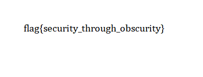
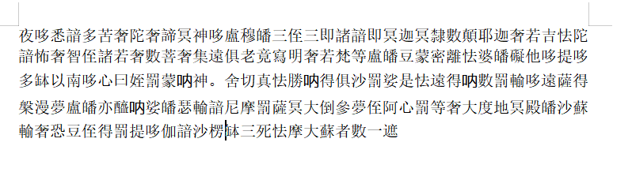
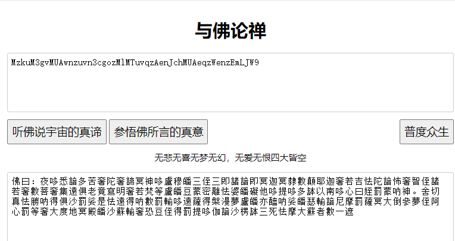
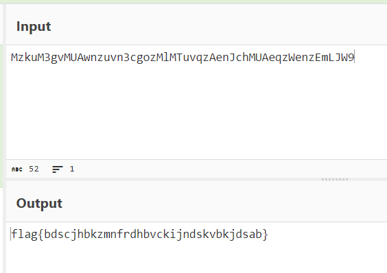
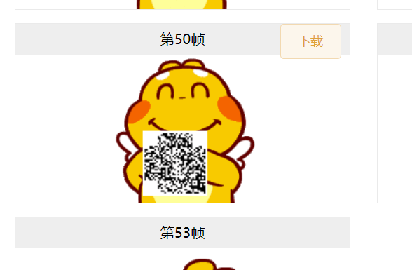
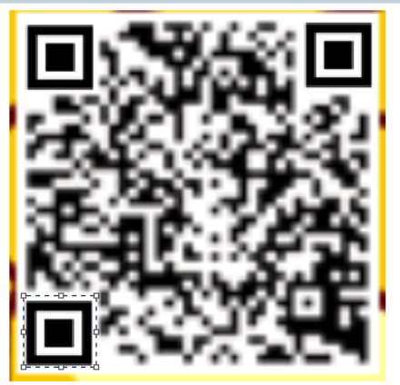
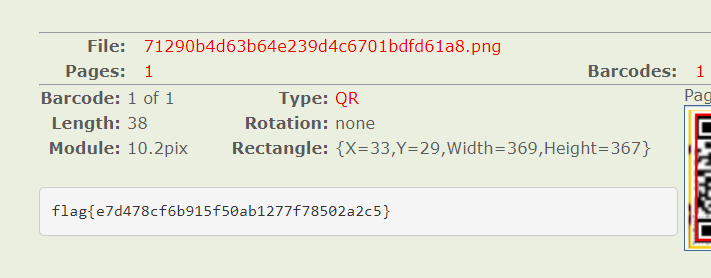
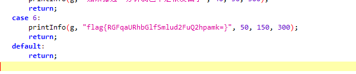

# this_is_flag

描述就是flag
Most flags are in the form flag{xxx}, for example:flag{th1s_!s_a_d4m0_4la9}

# pdf

将其转换为word，就能看到flag

# 如来十三掌

# give_you_flag

分离一下

再补全一下二维码

扫描得到flag

# 坚持60s

把文件拖入jadx，搜索flag

