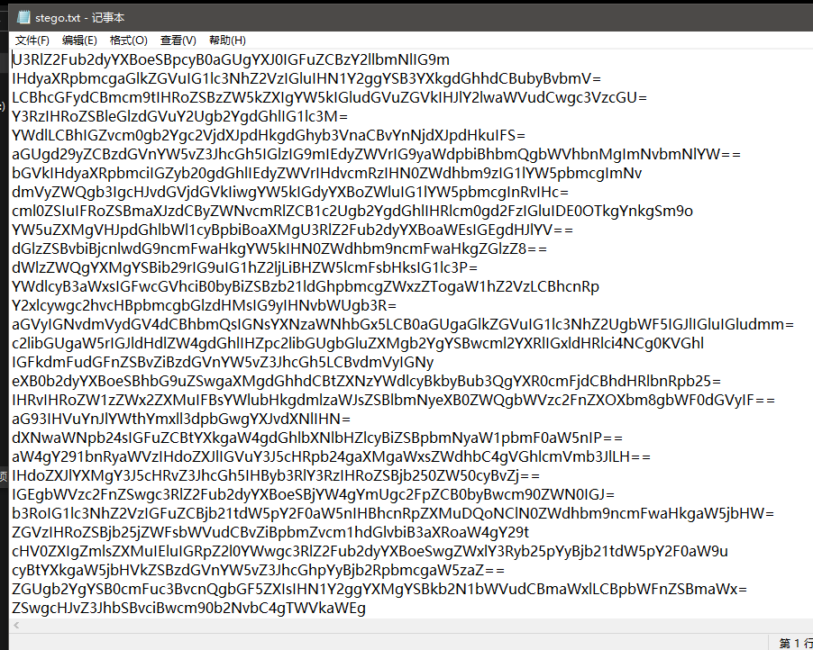

# pure_color


把图片丢入StegSolve


# SimpleRAR

压缩包里面有个文件


发现应该还有个png文件


将A8 3C 7A 改为A8 3C 74


解压后得到一个图片


是gif文件


更改后缀，然后进行分离


扔进stegsolve


补全二维码


flag


# base64stego

压缩包有密码


还有一个压缩包


发现是伪加密


把09改为00，可以解压了



解码得到一大段东西


找了个脚本

```csharp
import base64
bin_str=''
b64chars = 'ABCDEFGHIJKLMNOPQRSTUVWXYZabcdefghijklmnopqrstuvwxyz0123456789+/'
with open('stego.txt','r') as f:  # 这里要改成你的文件路径
 for line in f.readlines():
  s64="".join(line.split())
  r64="".join(str(base64.b64encode(base64.b64decode(s64)),'utf-8').split())
  offset=abs(b64chars.index(s64.replace('=','')[-1])-b64chars.index(r64.replace('=', '')[-1]))
  equal=line.count('=')
  if equal:
   bin_str += bin(offset)[2:].zfill(equal * 2)
 print(''.join([chr(int(bin_str[i:i + 8], 2)) for i in range(0,len(bin_str),8)]))
```

flag{Base_sixty_four_point_five}

# Training-Stegano-1


扔进010


flag就是steganoI

# 功夫再高也怕菜刀

一个pcapng文件，尝试搜索flag，在1150记录下看到有一个图片


1367下找到了文件


压缩包需要密码


jpg格式是以：FFD8FF开头，以FFD9结尾，保存下来


用010保存为十六进制


保存后缀为jpg，查看得到密码


输入密码，得到flag


