# gif

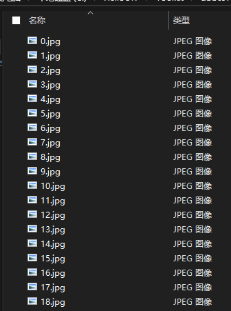

白色代表0，黑色代表1：01100110011011000110000101100111011110110100011001110101010011100101111101100111011010010100011001111101

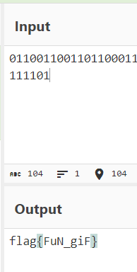

# stegano

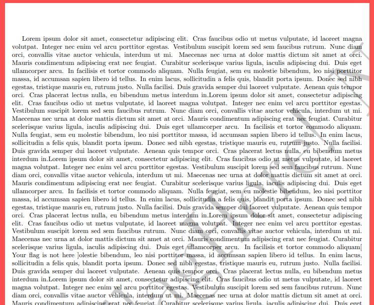

全部复制下来，有一串AB

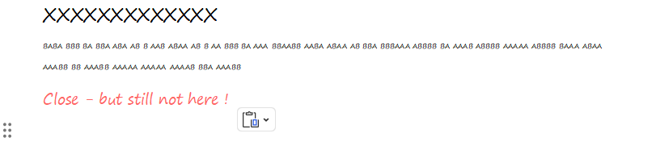

A=.    B=-

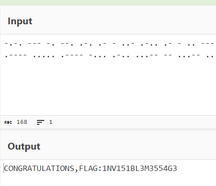

修改一下格式：flag{1NV151BL3M3554G3}

# 掀桌子

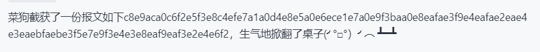

每两个一组转化为10进制，再减去128后转化为ASCII码：Hi, FreshDog! The flag is: hjzcy djz bjd cj kz kc ugi s dchjyjsbdfr

# Banmabanma

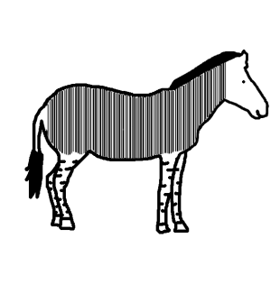

像条纹码，识别一下得到flag

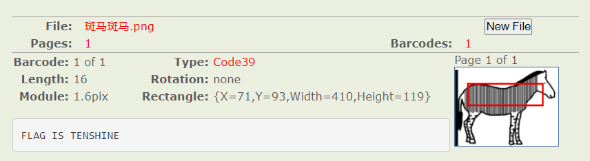

# ext3

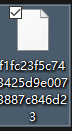

扔进010editor，发现有个flag.txt文件

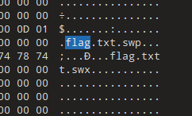

后缀修改为.zip，然后搜索flag

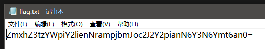

解码

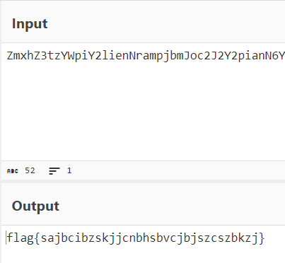
