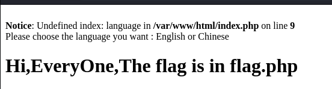
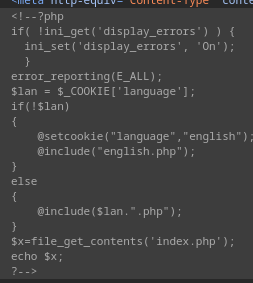
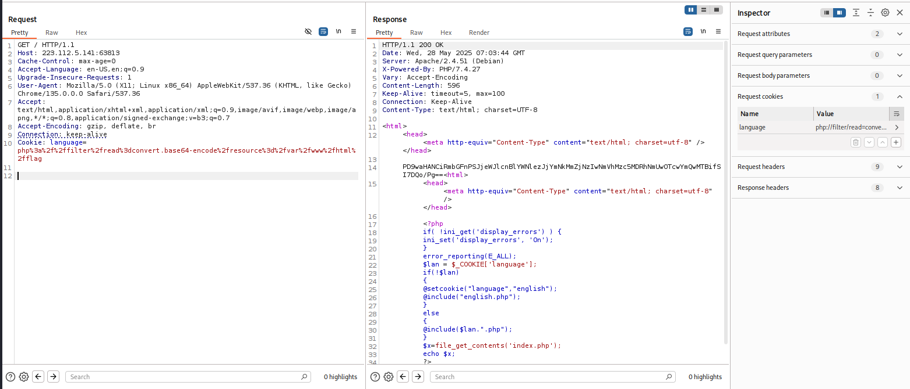
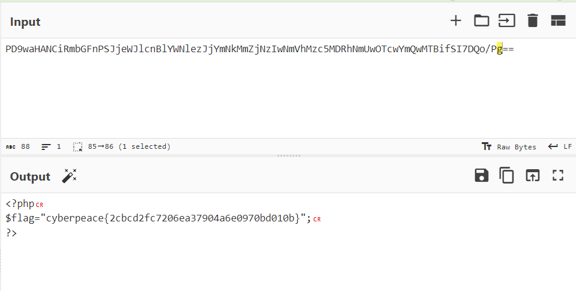

解析

```csharp
<?php
// 开启错误显示，方便调试
if( !ini_get('display_errors') ) {
    ini_set('display_errors', 'On');
}
error_reporting(E_ALL);

// 获取客户端语言Cookie
$lan = $_COOKIE['language'];

// 如果Cookie不存在，设置默认语言为英语并包含english.php
if(!$lan) {
    @setcookie("language", "english");
    @include("english.php");
}
// 如果Cookie存在，直接包含对应语言文件
else {
    @include($lan . ".php");
}

// 读取并输出当前文件(index.php)的源代码
$x = file_get_contents('index.php');
echo $x;
?>
```

思路：
在cookie中的内容language 会被传到变量$lan，继而在@include($lan.".php");被调用与执行，因此cookie变量中很适合写入读取flag.php的payload

解题：
我们添加一个cookie
Name：language
Value：php://filter/read=convert.base64-encode/resource=/var/www/html/flag
php://filter是PHP的输入/输出过滤器
read=convert.base64 - encode表示以Base64编码方式读取内容
resource=/var/www/html/flag指定了要读取的文件为服务器上“/var/www/html/”目录下名为“flag”的文件。



我们将加密字符串解密，就得到了flag


