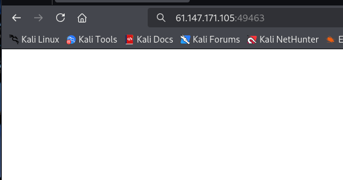
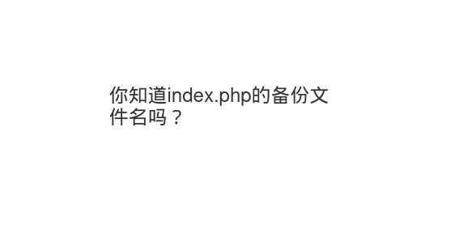
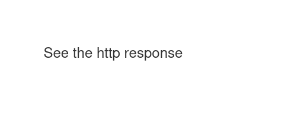
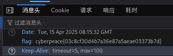
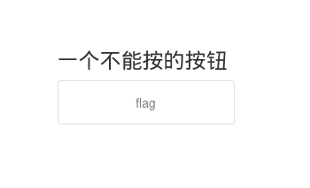

# view_source


```markup
F12

ctrl+u

ctrl+shift+i

URL前添加：view-source:

curl http://192.168.1.1
```

# robots



根据题目提示，查看一下robots.txt


/flag_ls_h3re.php


# backup



/index.php.bak

```markup
┌──(kali㉿kali)-[~]
└─$ cat index.php.bak                
<html>
<head>
    <meta charset="UTF-8">
    <title>备份文件</title>
    <link href="http://libs.baidu.com/bootstrap/3.0.3/css/bootstrap.min.css" rel="stylesheet" />
    <style>
        body{
            margin-left:auto;
            margin-right:auto;
            margin-TOP:200PX;
            width:20em;
        }
    </style>
</head>
<body>
<h3>你知道index.php的备份文件名吗？</h3>
<?php
$flag="Cyberpeace{855A1C4B3401294CB6604CCC98BDE334}"
?>
</body>
</html>
```

# cookie


查看一下cookie


看一下/cookie.php



找到了flag



# disabled_button



将源代码中的disabled删除
点击flag按钮

