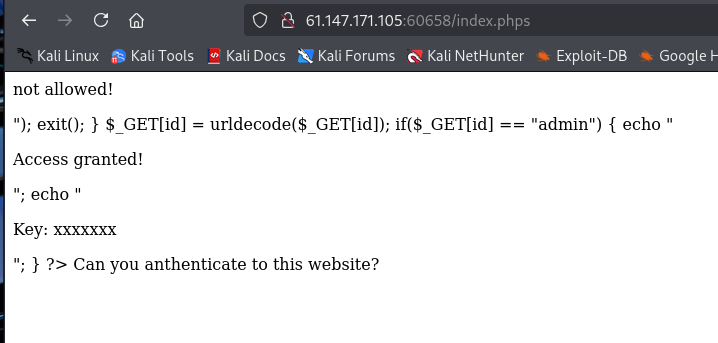

# xff_referer

拦截数据包添加：X-Forwarded-For: 123.123.123.123

添加：Referer: https://www.google.com

# baby_web

提示：想想初始页面是哪个
查看/index.php

# simple_js

尝试万能密码，没有成功，在源码中找到如下：

将pass=“70,65,85,88,32,80,65,83,83,87,79,82,68,32,72,65,72,65”转化为ASCII码结果为：FAUX PASSWORD HAHA
将dechiffre("\x35\x35\x2c\x35\x36\x2c\x35\x34\x2c\x37\x39\x2c\x31\x31\x35\x2c\x36\x39\x2c\x31\x31\x34\x2c\x31\x31\x36\x2c\x31\x30\x37\x2c\x34\x39\x2c\x35\x30")\x换成%，再进行URL解码结果为：55,56,54,79,115,69,114,116,107,49,50
再转化为ASCII码：786OsErtk12

flag就是：Cyberpeace{786OsErtk12}

# PHP2

访问/index.phps

将admin进行加密然后带到url后面：?id=%2561%2564%256d%2569%256e

# ics-06

报表中心可以打开

抓包测试一下，2333不一样

id=2333就可以得到flag

