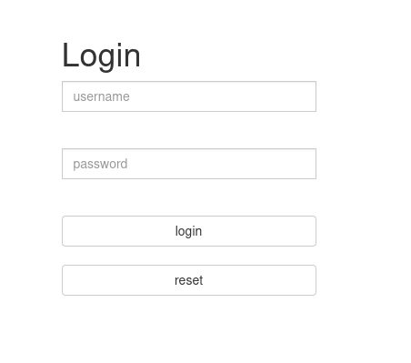
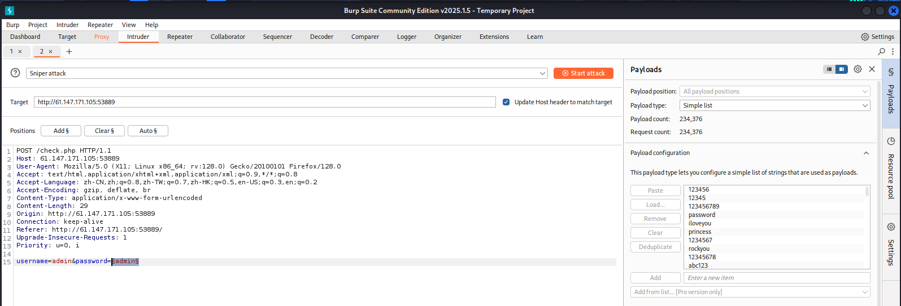
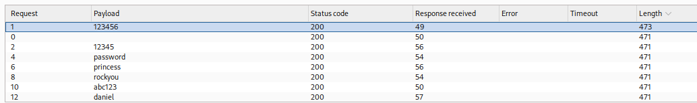
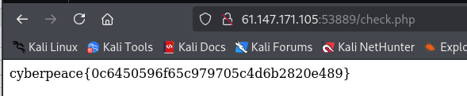

# get_post

用max hackbar在url后面加上?a=1

选择post，添加b=2

得到flag

# weak_auth

尝试万能密码：' admin or 1=1 -- #

尝试进行爆破

用爆破出来的密码进行登录

# simple_php

后面添加?a=0 && b=1235abc

# Training-WWW-Robots

查看/robots.txt

/fl0g.php

# command_execution

127.0.0.1;id，可以执行

查找flag：127.0.0.1;cat ../../../home/flag.txt

